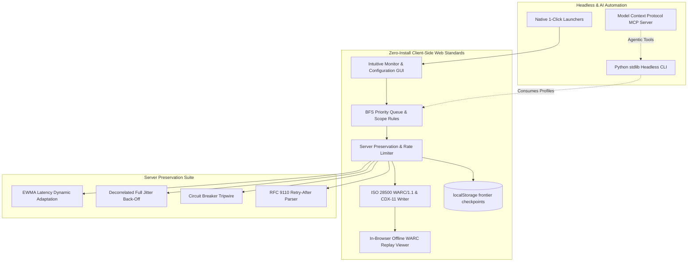

# AegisArchive

## AegisArchive

Zero-install, server-preserving web archiver and ISO 28500 (WARC/1.1) forensic engine for offline replication and digital preservation.

## Badges

[](../../actions/workflows/ci.yml)
[](../../actions/workflows/security.yml)
[](../../actions/workflows/standards-ci.yml)
[](LICENSE)
<!-- Scorecard badge: add only after a published result exists (standards rule). -->

## Status and scope

| Capability | Status |
| --- | --- |
| In-browser crawler with politeness engine (rate limits, backoff, `Retry-After`) | Implemented |
| WARC/1.1 writer with SHA-256 payload digests and `revisit` deduplication | Implemented |
| CDX-11 index generation | Implemented |
| In-browser replay viewer | Implemented |
| Headless Python CLI crawl (`cli/aegis_cli.py`) | Implemented |
| WARC/CDX integrity verifier (`cli/warc_verify.py`) | Implemented |
| MCP server with `list_profiles`, `search_archive`, `validate_profile` | Implemented |
| Hardened loopback station server, status page, bundle checksum verification | Implemented |
| OPFS streaming of large archives to disk | Implemented; memory fallback when unavailable |
| Frontier checkpoint/resume | Implemented with localStorage; earlier WARC bytes are not restored |
| Synthesised WARC `request` records | Implemented |
| `.warc.gz` input in verifier and viewer | Implemented |
| `.warc.gz` output | Planned |
| WACZ export and service-worker replay | Planned |
| Bundled portable runtimes and offline AI features | Planned |

Evidence limitation: features marked Planned are described in `conductor/` tracks and are not yet present in code.

### Roadmap

AegisArchive is planned to expand with portable runtimes and offline intelligence tools. See [conductor/tracks.md](conductor/tracks.md) for active track specifications and development status.

## Install

You do **not** need Docker, Node.js, `npm`, or database installations. AegisArchive runs directly on any computer with Python 3 and a modern web browser.

### On macOS
1. Download or clone this repository.
2. Double-click **`START_MAC.command`**.
3. Your web browser will open automatically to the AegisArchive Web Console.

### On Windows
1. Download or clone this repository.
2. Double-click **`START_WINDOWS.cmd`** (or right-click `START_WINDOWS.ps1` → *Run with PowerShell*).
3. Your browser will open automatically.

### On Linux
```bash
./START_LINUX.sh
```

### Python package (optional)

Installing via `pipx install git+https://github.com/edithatogo/aegisarchive` provides console entry points: `aegisarchive`, `aegisarchive-verify`, and `aegisarchive-mcp`. Note that the installed MCP server only lists profiles when run from a checkout repository.

## Usage

### Command Line Interface (CLI)

For headless servers, scheduled cron jobs, or containerized environments:

```bash
# Run headless crawl using a profile
python3 cli/aegis_cli.py --profile profiles/default_polite.json --output-dir ./archive

# Verify cryptographic integrity of any WARC file
python3 cli/warc_verify.py archive/aegis_preservation_20260905.warc
```

### Model Context Protocol (MCP) Server

AegisArchive includes a native MCP server for compatible AI agents and IDEs.

Add this to your MCP client settings (e.g. `mcp_settings.json`):
```json
{
  "mcpServers": {
    "aegisarchive": {
      "command": "python3",
      "args": ["/path/to/aegisarchive/mcp/server.py"]
    }
  }
}
```

#### Available Tools:
* `list_profiles`: Enumerate all available preservation profiles.
* `search_archive`: Search local CDX indexes for captured URLs and MIME types.
* `validate_profile`: Validate a custom profile JSON against the schema.

### Configuration Profiles

AegisArchive is 100% profile-driven. You can choose from bundled presets or create your own in the GUI:

| Profile | Target Scope | Politeness & Anti-DDoS |
| :--- | :--- | :--- |
| **Default Polite** (`profiles/default_polite.json`) | General preservation of public websites. | 25 req/min, 1.2s–3.2s Gaussian jitter, EWMA auto-throttle. |
| **Enterprise Intranet** (`profiles/enterprise_intranet.json`) | Internal portals (commercial CMS and collaboration platforms). | 20 req/min, 1.5s–4.0s delay, path blacklist for calendar loops. |
| **Rapid Research** (`profiles/rapid_research.json`) | Authorized staging servers, test mirrors, localhost. | 180 req/min, 4-worker concurrency, uniform jitter. |

### System Architecture



## Development and verification

To run verification commands locally:

```bash
# Run stdlib smoke and unit tests
python3 -m unittest discover -s tests -t . -p "test_*.py"

# Run station hardening and loopback security tests
python3 cli/test_station_hardening.py

# Run browser engine tests (security workflow implemented; hosted qualification pending)
node --test tests/js/*.test.js

# Run repository gate checks (security workflow implemented; hosted qualification pending)
python3 scripts/gate.py

# Quick CLI verification
python3 cli/launch.py --help
python3 cli/aegis_cli.py --help
python3 cli/warc_verify.py --help
```

See [conductor/index.md](conductor/index.md) for the project knowledge base and track planning system.

## Security

Please report vulnerabilities privately through GitHub Security Advisories as described in [SECURITY.md](SECURITY.md). Acknowledgement target is 48 hours. See [security-insights.yml](security-insights.yml) for machine-readable security posture.

## Citation

Cite using `CITATION.cff` (GitHub's *Cite this repository* button).

## Licence and third-party rights

AegisArchive is licensed under the Apache License, Version 2.0. See [LICENSE](LICENSE) and [NOTICE](NOTICE) for details.

The file `web/lib/minisearch.min.js` is third-party software licensed under the MIT License; its license header is retained in the source file.

### Ethical archival charter

AegisArchive is designed for legitimate research, digital preservation, and institutional compliance. It embodies ethical principles:
1. **Never Flood Servers**: Strict rate limits and burst caps prevent server distress.
2. **Back Off on Congestion**: Automatically slows down when server response latencies spike.
3. **Respect RFC 9110**: Complies immediately with HTTP 429 (`Too Many Requests`) and `Retry-After` headers.
4. **Transparent Identity**: Sends polite, informative `User-Agent` metadata.

## Deployment independence

AegisArchive is a general-purpose archival engine. Keep organisation-specific URLs, credentials, source inventories, acceptance receipts and downstream analysis in the consuming project's private configuration. Examples use reserved domains or loopback addresses. A particular website's access or login state is not an engine completion gate. Upstream dependency, licence and standards references identify technical provenance, not deployment targets.
